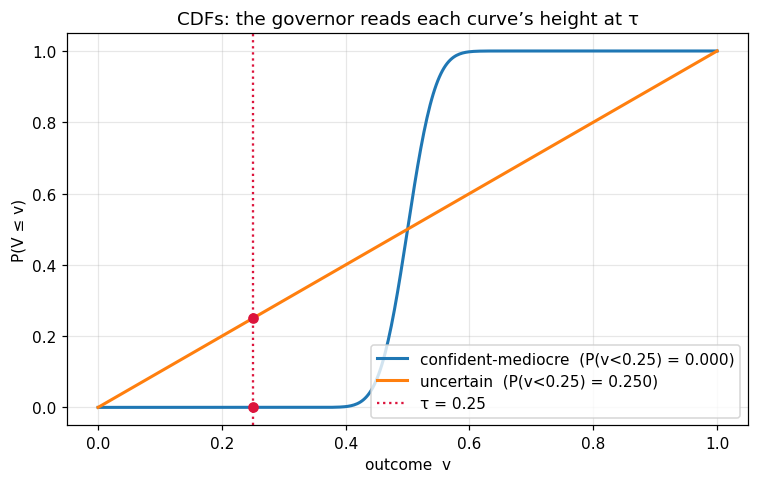
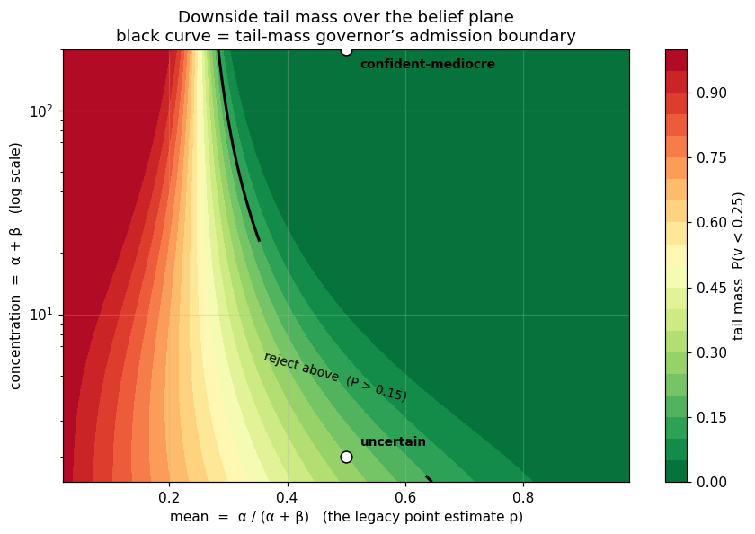

# beta-swarm

**Distributional safety with a full belief over a continuous outcome.**

A generalization of the soft-label formalism in
[`distributional-agi-safety`](https://github.com/swarm-ai-safety/swarm). Where
that framework carries a single scalar `p = P(v = +1)` per interaction, an agent
here carries a parameterized **distribution** over a continuous quality
`v ∈ [0, 1]`:

$$F = \mathrm{Beta}(\alpha, \beta)$$

That belief decomposes into two interpretable quantities:

| Quantity | Formula | Recovers / adds |
|---|---|---|
| **mean** | `α / (α + β)` | the old point estimate `p` |
| **concentration** | `α + β` | *new:* epistemic uncertainty |

This separates two situations the scalar formalism collapses into one number:

- **confident the interaction is mediocre** — mean ≈ 0.5, high concentration
- **uncertain whether it's great or terrible** — mean ≈ 0.5, low concentration

Both have `p = 0.5`. They differ entirely in their downside tail mass.

> 📓 The figures throughout this README are generated by
> [`examples/belief_shapes.ipynb`](examples/belief_shapes.ipynb) — a runnable
> visual tour of the belief shapes, the governance lever, and the quality gap.


A catalog of the shapes a belief can take. **Down a column** the mean is fixed
and concentration grows, so the belief sharpens around the same point;
**across a row** concentration is fixed and the mean shifts. The top row
(concentration 2) is the diffuse, "we don't know yet" regime — the same row a
scalar `p` would report as a confident `0.2` / `0.5` / `0.8`. Generated by
[`examples/belief_shapes.ipynb`](examples/belief_shapes.ipynb).

## What the generalization buys you

| Concept | Scalar `p` | beta-swarm |
|---|---|---|
| Quality label | `p ∈ [0, 1]` | `Beta(α, β)` over `v ∈ [0, 1]` |
| Payoff | `S_soft = p·s₊ − (1−p)·s₋` | `E_F[surplus(v)]` |
| Governance lever | threshold on `p` | tail mass `P(v < τ)`, Value-at-Risk |
| Quality gap | `E[p\|acc] − E[p\|rej]` | Wasserstein-1 / KL between accepted & rejected belief distributions |
| Calibration | Brier score | CRPS (continuous proper score) |

### The lever, visualized



The governor's lever is just a height on the CDF: at the threshold `τ`, the
value of each cumulative curve *is* its tail mass `P(v < τ)`. The two same-mean
beliefs cross near the mean but separate sharply at the left — the sharp belief
reads `0.000`, the diffuse one `0.250`. Sweeping that reading across all beliefs
gives the contour below.



Tail mass `P(v < τ)` across the whole belief space: mean on the x-axis (the
legacy point estimate `p`), concentration on the log y-axis. The black curve is
a tail-mass governor's admission boundary (`max_tail_mass = 0.15`). It is a
**curve, not a vertical line** — at a fixed mean, dropping concentration inflates
the downside tail, so a less-certain belief must clear a higher mean to be
admitted. The two marked beliefs share `mean = 0.5` yet land on opposite sides
of the boundary; a mean-only policy cannot separate them. Generated by
[`examples/belief_shapes.ipynb`](examples/belief_shapes.ipynb).

### The quality gap, as a distance between distributions


The scalar gap `E[p|acc] − E[p|rej]` is a single signed number. With full
beliefs the question becomes *how far apart are the accepted and rejected
populations as distributions* — answered by the Wasserstein-1 distance between
their belief mixtures. Above, an adversely-selected market accepts the
lower-quality interactions (red) and rejects the higher-quality ones (green):
the **negative mean gap** flags the adverse selection, while **W₁** quantifies
the separation. Generated by
[`examples/belief_shapes.ipynb`](examples/belief_shapes.ipynb).

Every distributional quantity **reduces to the scalar one** when the surplus is
linear and the belief is sharp — beta-swarm is a strict superset. The payoff
only departs from the mean-based value when the surplus is **nonlinear**, at
which point the *shape* of the belief (not just its mean) moves the payoff. A
convex downside penalty, for instance, makes a diffuse "great-or-terrible"
belief strictly worse than a sharp "mediocre" one with the same mean.

## Install

```bash
pip install -e ".[dev]"
```

## Quickstart

```python
from beta_swarm import BetaBelief, TailMassGovernor

confident_mediocre = BetaBelief.from_mean_concentration(mean=0.5, concentration=200)
uncertain          = BetaBelief.from_mean_concentration(mean=0.5, concentration=2)

# Same mean — a scalar-p policy cannot tell them apart:
assert confident_mediocre.mean == uncertain.mean == 0.5

# But the downside tail mass is completely different:
confident_mediocre.tail_mass(0.25)   # -> 0.000
uncertain.tail_mass(0.25)            # -> 0.250

# A tail-mass governor rejects the risky one and admits the reliable one:
gov = TailMassGovernor(tau=0.25, max_tail_mass=0.15)
gov.accepts(confident_mediocre)   # True
gov.accepts(uncertain)            # False
```

[`examples/demo.py`](examples/demo.py) runs the full side-by-side:

```text
Two beliefs, identical mean (= the legacy point estimate p):

  confident-mediocre  BetaBelief(alpha=100, beta=100 | mean=0.500, conc=200)
  uncertain           BetaBelief(alpha=1, beta=1 | mean=0.500, conc=2)

Downside tail mass  P(v < 0.25):
  confident-mediocre  0.000
  uncertain           0.250

Tail-mass governor (reject if P(v<0.25) > 0.15):
  confident-mediocre  ACCEPT   (P(v < 0.25) = 0.000 within tolerance)
  uncertain           REJECT   (P(v < 0.25) = 0.250 > 0.150: downside risk too high)

Expected surplus with a convex downside penalty (gamma=2):
  confident-mediocre  +0.749
  uncertain           +0.667

5%-Value-at-Risk outcome (the quality you can count on 95% of the time):
  confident-mediocre  0.442
  uncertain           0.050
```

For the visual tour of the same results, see
[`examples/belief_shapes.ipynb`](examples/belief_shapes.ipynb) (belief shapes,
the CDF tail the governor reads, the tail-mass contour, and the
accepted-vs-rejected quality gap as a distance between distributions).

## Closing the loop: simulation

The parent SWARM framework's central lesson is that safety phenomena are
*emergent* — you only see them by running populations of behavioral archetypes
through a governed interaction loop. `beta_swarm.simulation` ports that loop
and generalizes three of its mechanisms to distributions:

- **Reputation is a belief.** The governor keeps a `BetaBelief` per agent,
  conjugately updated with realized outcomes. Reputation decay becomes
  *concentration* decay: a neglected reputation diffuses back toward
  "we don't know", rather than sliding toward a default score.
- **Evidence pools.** The per-interaction proxy belief and the initiator's
  reputation belief combine by adding pseudo-counts (`pool_beliefs`).
- **Audits add evidence.** A `DEFER` verdict routes the interaction to an audit
  that injects pseudo-counts of the (noisily observed) true outcome, sharpening
  the belief before the governor re-decides — at a cost that falls on unproven
  agents and fades as their reputation concentrates.

The agent population distills SWARM's fifty-odd archetypes to the three that
matter distributionally — honest, mediocre, and **deceptive**. A deceptive
agent inflates the *level* of its observables (reports high progress, hides
rework and verifier events) but cannot fake the *volume* of evidence, so its
beliefs arrive with a high mean and low concentration. That diffuse shape is
the distributional fingerprint of deception — invisible to scalar `p`.

[`examples/governor_showdown.py`](examples/governor_showdown.py) runs the same
seeded population under the legacy mean-threshold lever and the tail-mass
lever:

```text
                           mean governor   tail governor
--------------------------------------------------------
realized welfare                   +69.8          +147.6
realized toxicity                  0.380           0.344
audits run                             0             521
mean CRPS (calibration)           0.1011          0.0593

Acceptance rate by archetype:
  honest                100%             99%
  mediocre               88%             74%
  deceptive              12%              0%

Epoch 0 deceptive acceptance — mean governor: 73%, tail governor: 0%.
```

The mean governor admits deceptive work wholesale until pooled reputation drags
each agent's mean under the bar — paying for the damage it learns from, and
letting reputation decay re-admit them intermittently forever. The tail
governor defers exactly the diffuse beliefs to audit and shuts deception out
from epoch 0, before any reputation exists. (One tuning constraint: the defer
threshold must be reachable by a single audit — roughly base concentration +
`audit_strength` — or every interaction loops `DEFER → REJECT` and the
ecosystem shuts down.)

## Collusion: the fingerprint is in the shape

The parent framework's collusion detector uses two scalar signals — unusual
pair frequency, and quality asymmetry (high `p` inside the ring, low `p`
outside). A competent ring defeats the second by lying to *everyone*: belief
means inside and outside the ring come out nearly identical.

The distributional fingerprint survives, because **corroboration is
evidence**. A ring counterparty actively confirms the inflated signals with
faked engagement — the one channel a lone deceiver cannot manufacture — so
within-ring beliefs arrive with the same mean but systematically *higher
concentration*. `CollusionDetector` reads that shape asymmetry (Wasserstein-1
between within-pair and arm's-length belief mixtures, concentration lift, tail
asymmetry) alongside the graph signal (frequency lift).

[`examples/collusion_ring.py`](examples/collusion_ring.py) hides a three-agent
ring in a mixed population under a permissive mean-threshold governor:

```text
pair                           n   freq  mean gap  W1 gap   conc  suspicion
---------------------------------------------------------------------------
colluder-0 -> colluder-1      45   4.0x    +0.050   0.050  1.38x      0.201
colluder-2 -> colluder-1      46   4.1x    +0.046   0.046  1.36x      0.192
colluder-1 -> colluder-0      52   4.7x    +0.040   0.040  1.33x      0.188
...

Ring pairs flagged: 6/6; false positives: 0.
```

The scalar tell is a mean gap of +0.05; the shape tells are a 1.35x
concentration lift and the missing downside tail. Two log-design lessons made
this work: score the **per-interaction evidence belief** (`proxy_belief`), not
the reputation-pooled decision belief — a shared prior enters every pooled
belief identically and smears out per-pair contrast — and baseline each pair
against the initiator's **arm's-length traffic** only, or fellow ring members
contaminate the comparison.

## Package layout

| Module | Contents |
|---|---|
| `beta_swarm.belief` | `BetaBelief` — mean, concentration, tail mass, quantiles, conjugate updates |
| `beta_swarm.payoff` | `DistributionalPayoffEngine` — `E_F[surplus(v)]`, configurable downside curvature |
| `beta_swarm.governance` | `TailMassGovernor`, `ValueAtRiskGovernor` — risk-aware admission |
| `beta_swarm.metrics` | Wasserstein/KL quality gap, distributional toxicity, CRPS |
| `beta_swarm.proxy` | `BetaProxyComputer` — observables → belief (mean *and* concentration) |
| `beta_swarm.interaction` | `BetaInteraction` — interaction carrying a `BetaBelief` |
| `beta_swarm.agents` | `SimAgent` archetypes — honest, mediocre, deceptive, colluder emission models |
| `beta_swarm.simulation` | `Simulation` — governed epoch loop, belief reputation, audits, epoch metrics |
| `beta_swarm.collusion` | `CollusionDetector` — ring detection from belief-shape asymmetry |

## Tests

```bash
python -m pytest -q
```

## License

MIT.
